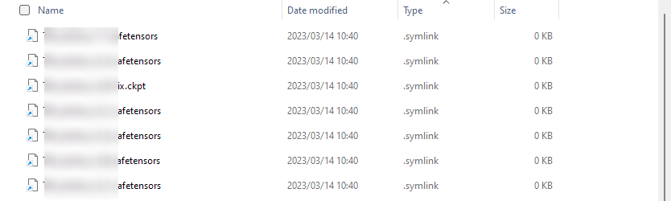
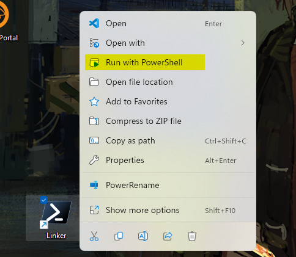
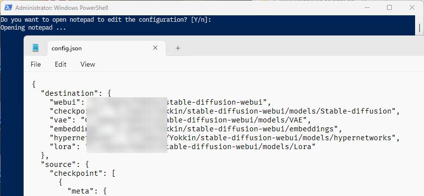

# SD-Linker



Using this utility enables you to make a hardlink or a symlink of various weight
files used in Stable Diffusion Web UI (`*.safetensors`, `*.ckpt`, `*.pt`, or
something like that) without copying weights from their original folders.  
Since this will just make no real copy of files, making links or its deletion 
is really fast, whereas model files are usually a big deal for SSD or HDD.

This utility should be run in PHP environment installed.

<https://www.php.net/>

## How to use

To make a hardlink or symbolic link, run the PowerShell script with:

```plain
./run.ps1
```

Note that you need to make configuration in advance if the configuration is not
ready! (if so you can refer to `Making a template for config file` section later)

The utility will automaticaly escalate the program and try to start with
administrative privileges since Windows only allows administrator to make 
a symbolic link.

or you can launch the program without opening a terminal, it's really useful!



Then prompt will ask whether you want to open the config file,
you can answer `y`, `n`, or just pressing enter key (in this case it is
equivalent as you answer `y`). If you answer `n`, the program just makes
symbolic links and then exits. 

```plain
Do you want to open notepad to edit the configuration? [Y/n]: y
```

Edit your config file with the editor you preferred, close it as you finished
editing ― That's it!



### Making a template for config file

You can easily prepare your new configuration file executing this command
below:

```
php src/main.php newconfig foo.json
```

In this example a new configuration file will be made as `foo.json`.  
(btw my apologies for bad naming for a subcommand)

## Setting

Before you work on this program you need to prepare the configuration.
Just open `config/config.json` in your text editor, and start setting the 
installation directory for Stable Diffusion Web UI and weights used by the UI.

Config file is roughly separated into two sections: `desination` and `source`.
In `destination`, you can specify the destination for symbolic links or 
hardlinks to real weights to be placed, while `source` is for the location for
original weights living in.

`source` section is also devided into some sections so you can tell the type
of weights from others. The types are like: `checkpoint`, `vae`, `embeddings`, 
`hypernetworks`, `lora`.

Schema

Note that since the configuration in written in JSON format, the comment in 
this example is not anything for the parser to understand.
Please eliminate them while you edit the configuration. 

```json
{
  "destination": {
    "webui": "",
    "checkpoint": "",
    "vae": "",
    "embeddings": "",
    "hypernetworks": "",
    "lora": ""
  },
  "source": {
    "checkpoint": [
      {
        "meta": {
          // you can leave some comments on each entry
          "comment": "",
          // setting this to false all the models in entry 'weightList' will be unlinked!
          "enabled": true
        },
        // set your base directory for the weights in 'weightsList'
        "baseDirectory": "C:/foo",
        "weightsList": [
          // just write filename!
          "foo.safetensors"
        ],
        // moving models on 'ignoreList' also allows to set model status one by one.
        // it is not a mandatry entry: you can omit!
        "ignoreList": [
          // just write filename!
          "something.ckpt"
        ]
      }
    ],
    "vae": [
      // same as above
    ],
    "embeddings": [
      // same as above
    ],
    "hypernetworks": [
      // same as above
    ],
    "lora": [
      // same as above
    ]
  }
}
```

## About run.ps1

We have a PowerShell script `run.ps1` so the script can be easily triggered from right 
click context menu in Windows.  While it is useful you have to put some effort to
edit the PowerShell script, so here we have short explanation about the script:

### `$executables` 

`$executables` can be specified to your favorite text editor you are going to use to edit 
the configuration. Please assign your choice such as notepad in Windows, Notepad++ and so 
on, but note that Visual Studio Code is not supported currently (I don't know why, but it 
doesn't work in actual). 


## Misc

### Environments

```plain
> php --version
PHP 8.2.3 (cli) (built: Feb 14 2023 09:54:05) (NTS Visual C++ 2019 x64)
Copyright (c) The PHP Group
Zend Engine v4.2.3, Copyright (c) Zend Technologies
```

### Todo

- Provide the ability to change the name of the symbolic destination

### References

- <https://github.com/AUTOMATIC1111/stable-diffusion-webui>
